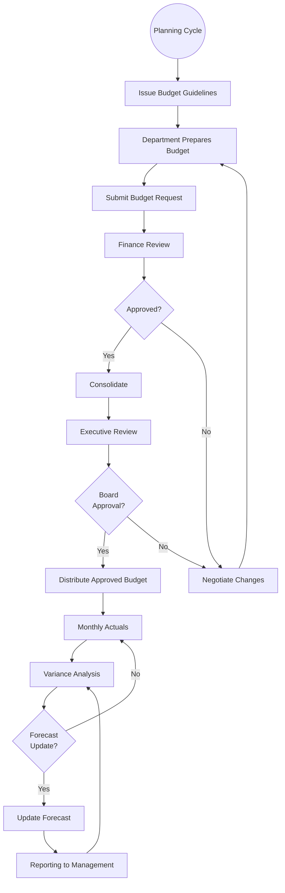

# Budgeting & Forecasting

## Workflow Purpose

Budgeting and forecasting is the process of setting financial targets, allocating resources, and projecting future financial performance to guide strategic decision-making.

## Business Objective

Align organizational resources with strategic goals, provide financial targets for performance measurement, and enable proactive management through forward-looking insights.

## Primary Users

- **CFO** — owns the budgeting process and strategic plan
- **Finance Manager** — coordinates budget preparation and consolidation
- **Controller** — provides historical data and variance analysis
- **Department Heads** — input budget requests and forecasts
- **Executive Viewer** — reviews and approves budget

## Detailed Process

## Inputs & Outputs

| Inputs | Outputs |
|---|---|
| Historical financial data | Annual budget |
| Strategic plan / growth targets | Monthly/quarterly forecasts |
| Department resource requests | Variance reports |
| Headcount plans | Long-range plan (3-5 year) |
| Market assumptions | Scenario models |
| Capital expenditure plans | Rolling forecast |

## Systems & Dependencies

| System | Role |
|---|---|
| ERP / GL | Historical actuals |
| Planning tool | Budget input, consolidation, modeling |
| Reporting tool | Variance analysis, distribution |
| Spreadsheets | Department-level input (still dominant) |
| BI tool | Executive dashboards |

## Approval Steps & Decision Points

| Step | Approver |
|---|---|
| Department budget | Department Head → Finance Manager |
| Consolidated budget | CFO |
| Final approval | Board of Directors |
| Forecast revision | CFO |
| Capital expenditure approval | CFO → Board (threshold-based) |

## Risks & Bottlenecks

| Risk | Impact |
|---|---|
| Spreadsheet-based budgeting | Version control, error risk |
| Late departmental submissions | Delayed consolidation |
| Unrealistic targets | Demotivation, gaming |
| Infrequent forecast updates | Stale view of business |
| No driver-based planning | Manual what-if analysis |
| Disconnected from strategy | Misaligned resources |

## KPIs

| KPI | Target |
|---|---|
| Budget cycle time | < 60 days |
| Forecast accuracy | < 5% variance |
| Budget submission on-time % | 100% |
| Variance explanation timeliness | < 5 days post-close |
| Rolling forecast adoption | Quarterly |
| Planning cycle satisfaction | > 4/5 |

## Automation & AI Opportunities

| Opportunity | Impact |
|---|---|
| Driver-based planning | Links operational drivers to financial outcomes |
| AI-powered forecasting | ML-based predictions vs manual |
| Automated variance commentary | NLP-generated explanations |
| What-if scenario modeling | Instant sensitivity analysis |
| Rolling forecast automation | Continuous planning |
| Collaborative budget input | Cloud-based multi-user input |
| Intelligent anomaly detection in submissions | Flags unrealistic budget entries |

## Persona Mapping

| Persona | Involvement |
|---|---|
| CFO | Owner, approver, strategist |
| Finance Manager | Coordinator, analyst |
| Controller | Historical data provider |
| Department Head | Input provider |
| Executive Viewer | Review and approval |

## Pain Point Mapping

| Pain Point | Severity |
|---|---|
| Spreadsheet-based budgeting | Critical |
| Slow budget cycle | Major |
| No rolling forecast | Major |
| Manual variance analysis | Major |
| Disconnected from operational planning | Major |

## Competitive Analysis

| Capability | SAP | Oracle | Dynamics | NetSuite | Odoo | Perionyx |
|---|---|---|---|---|---|---|
| Budget input and workflow | ✅ | ✅ | ✅ | ✅ | ✅ | ❌ |
| Forecasting engine | ✅ | ✅ | ✅ | ✅ | ⚠️ | ❌ |
| Rolling forecast | ✅ | ✅ | ✅ | ✅ | ❌ | ❌ |
| Driver-based modeling | ✅ | ✅ | ✅ | ⚠️ | ❌ | ❌ |
| Scenario / what-if analysis | ✅ | ✅ | ✅ | ✅ | ❌ | ❌ |
| Variance analysis | ✅ | ✅ | ✅ | ✅ | ⚠️ | ❌ |
| Collaborative planning | ✅ | ✅ | ✅ | ✅ | ❌ | ❌ |

## Perionyx Features Supporting Workflow

No direct support beyond financial reporting.

## Future Product Opportunities

| Opportunity | Priority |
|---|---|
| Driver-based planning model | P2 |
| Budget input and approval workflow | P2 |
| Rolling forecast engine | P2 |
| AI-powered variance commentary | P1 |
| What-if scenario modeling | P2 |
