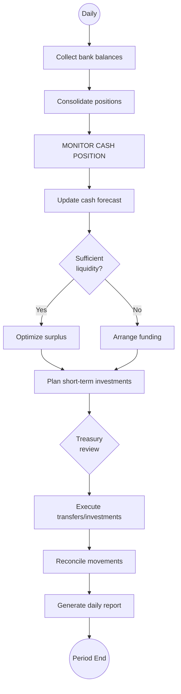

# Cash Management

## Workflow Purpose

Cash management encompasses the daily monitoring, forecasting, and optimization of an organization's cash position to ensure sufficient liquidity for operational needs while maximizing returns on surplus cash.

## Business Objective

Maintain optimal liquidity levels, minimize borrowing costs, maximize returns on idle cash, and provide accurate cash forecasts for strategic decision-making.

## Primary Users

- **Treasury Director** — owns cash positioning and forecasting
- **CFO** — reviews liquidity strategy and approves major decisions
- **Finance Manager** — executes transfers and monitors positions
- **Accountant** — reconciles cash movements and bank accounts

## Detailed Process

## Inputs & Outputs

| Inputs | Outputs |
|---|---|
| Bank account balances | Daily cash position report |
| Forecasted inflows (AR, investments) | Cash flow forecast (7/30/90 day) |
| Forecasted outflows (AP, payroll, debt) | Liquidity report |
| FX rates | Funding requirements |
| Investment portfolio | Investment recommendations |
| Debt schedule | Compliance reports (covenants) |

## Systems & Dependencies

| System | Role |
|---|---|
| Bank portals / SWIFT | Balance and transaction data |
| Treasury Management System (TMS) | Position consolidation, forecasting |
| ERP | AP/AR forecast data |
| FX platforms | Exchange rates |
| Investment platforms | Portfolio management |
| Reporting tool | Daily cash position report |

## Approval Steps & Decision Points

| Step | Approver | Notes |
|---|---|---|
| Transfer > threshold | Treasury Director | Wire transfer approval |
| Investment decision | Treasury Director → CFO | Surplus deployment |
| Borrowing decision | CFO | External funding |
| FX hedge | Treasury Director → CFO | Risk management |
| Inter-company loan | CFO | Cash pooling |

## Risks & Bottlenecks

| Risk | Impact |
|---|---|
| Inaccurate cash forecast | Missed payments or idle cash |
| Delayed bank balance data | Stale position view |
| Manual data collection | Time-consuming, error-prone |
| FX volatility | Unhedged exposure |
| Failed transfer | Payment delay |
| Covenant breach | Debt acceleration |

## KPIs

| KPI | Target |
|---|---|
| Forecast accuracy (7-day) | > 95% |
| Forecast accuracy (30-day) | > 90% |
| Cash visibility (same-day) | 100% of accounts |
| Idle cash % | < 2% of total cash |
| Transfer failure rate | < 0.1% |
| FX exposure hedged % | > 80% of policy |
| Days to complete month-end cash reporting | < 2 days |

## Automation & AI Opportunities

| Opportunity | Impact | Effort |
|---|---|---|
| Automated bank balance aggregation | Real-time visibility | Medium |
| AI-powered cash flow forecasting | Improved accuracy (15-20%) | High |
| Automated FX hedging recommendations | Reduced manual analysis | Medium |
| Intelligent cash positioning | Optimal liquidity allocation | High |
| Anomaly detection on cash movements | Fraud prevention | Medium |
| Automated daily cash report generation | Eliminates manual reporting | Low |
| Predictive working capital optimization | Strategic recommendations | High |

## Persona Mapping

| Persona | Involvement | Tasks |
|---|---|---|
| Treasury Director | Primary | Position monitoring, forecasting, strategy |
| CFO | Approver | Strategy approval, major decisions |
| Finance Manager | Operator | Transfer execution, reporting |
| Accountant | Support | Reconciliation, data collection |

## Pain Point Mapping

| Pain Point | Severity |
|---|---|
| Manual bank balance collection | Critical |
| Spreadsheet-based forecasting | Major |
| No real-time cash visibility | Critical |
| Manual FX exposure tracking | Major |
| Disconnected investment tracking | Major |

## Competitive Analysis

| Capability | SAP | Oracle | Dynamics | NetSuite | Odoo | Perionyx |
|---|---|---|---|---|---|---|
| Bank balance aggregation | ✅ | ✅ | ⚠️ | ✅ | ❌ | ❌ |
| Cash forecasting | ✅ | ✅ | ⚠️ | ✅ | ❌ | ❌ |
| FX management | ✅ | ✅ | ❌ | ⚠️ | ❌ | ⚠️ |
| Investment management | ✅ | ✅ | ❌ | ❌ | ❌ | ❌ |
| Debt management | ✅ | ✅ | ❌ | ❌ | ❌ | ❌ |
| Bank communication (SWIFT) | ✅ | ✅ | ❌ | ⚠️ | ❌ | ❌ |
| Daily cash position reporting | ✅ | ✅ | ⚠️ | ✅ | ❌ | ❌ |

## Perionyx Features Supporting Workflow

| Feature | Status |
|---|---|
| Wallet management (multi-currency) | ✅ Shipped |
| Transaction tracking | ✅ Shipped |
| FX rate display | ⚠️ Admin only |
| Account management | ✅ Shipped |

## Future Product Opportunities

| Opportunity | Priority |
|---|---|
| Bank balance aggregation dashboard | P1 |
| Cash flow forecasting engine | P1 |
| Daily cash position report | P1 |
| FX exposure tracking and hedging | P1 |
| Bank connectivity (Plaid, SWIFT) | P1 |
| Automated investment recommendations | P2 |
| Liquidity planning and scenario modeling | P2 |
