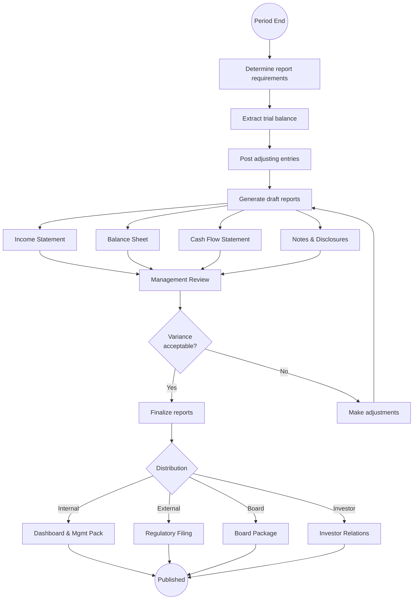

# Financial Reporting

## Workflow Purpose

Financial reporting covers the creation, review, and distribution of financial reports to internal stakeholders (management, board) and external parties (regulators, investors, banks).

## Business Objective

Provide accurate, timely, and decision-useful financial information to stakeholders while maintaining compliance with accounting standards and regulatory requirements.

## Primary Users

- **CFO** — reviews and approves external reports
- **Controller** — owns report preparation and accuracy
- **Finance Manager** — prepares reports and manages distribution
- **Accountant** — provides data and supporting schedules
- **Executive Viewer** — consumes reports for decision-making
- **Auditor** — verifies report accuracy

## Detailed Process

## Inputs & Outputs

| Inputs | Outputs |
|---|---|
| Adjusted trial balance | Income Statement |
| Prior period reports | Balance Sheet |
| Supporting schedules (AR, AP, FA) | Cash Flow Statement |
| Tax calculations | Statement of Equity |
| Disclosure information | Notes to Financial Statements |
| Variance explanations | MD&A (Management Discussion) |
| Currency rates | Board presentation |
| Consolidation adjustments | Regulatory filings |

## Systems & Dependencies

| System | Role |
|---|---|
| ERP / GL | Trial balance and sub-ledger data |
| Reporting tool | Report generation and formatting |
| Consolidation tool | Multi-entity aggregation |
| Spreadsheets | Manual formatting and notes |
| Filing system | Edgar, HMRC, etc. |
| BI dashboard | Executive distribution |

## Approval Steps & Decision Points

| Step | Approver |
|---|---|
| Supporting schedule review | Controller |
| Draft financial statement review | Controller → CFO |
| Variance explanation approval | CFO |
| External filing approval | CFO |
| Board presentation review | CFO → Board |

## Risks & Bottlenecks

| Risk | Impact |
|---|---|
| Manual report preparation | Error-prone, time-consuming |
| Spreadsheet-linked reports | Breakage risk |
| Disclosure completeness | Regulatory penalty |
| Version control on reports | Outdated info distributed |
| Filing deadline pressure | Material error risk |

## KPIs

| KPI | Target |
|---|---|
| Report cycle time (close to publish) | < 10 days |
| External filing accuracy | Zero restatements |
| Report distribution timeliness | Within 1 day of approval |
| Stakeholder satisfaction | > 4/5 |
| Ad-hoc report turnaround | < 4 hours |
| Disclosure completeness | 100% of requirements |

## Automation & AI Opportunities

| Opportunity | Impact |
|---|---|
| Automated report generation from trial balance | Eliminates manual preparation |
| AI-powered variance commentary | Auto-generates MD&A |
| Natural language report querying | "Show me revenue by region" |
| Automated filing preparation | Reduces filing prep by 80% |
| Intelligent disclosure checklist | Ensures completeness |
| Report distribution automation | Role-based, scheduled delivery |
| XBRL tagging automation | Eliminates manual coding |

## Persona Mapping

| Persona | Involvement |
|---|---|
| CFO | Owner, approver, consumer |
| Controller | Report owner, accuracy gatekeeper |
| Finance Manager | Report preparer |
| Accountant | Data provider |
| Executive Viewer | Report consumer |
| Auditor | Report verifier |

## Pain Point Mapping

| Pain Point | Severity |
|---|---|
| Manual report preparation in spreadsheets | Critical |
| No drill-down from reports to source data | Major |
| Slow ad-hoc report generation | Major |
| Disclosure management is manual | Major |
| No role-based report distribution | Minor |
| Filing preparation is time-consuming | Major |

## Competitive Analysis

| Capability | SAP | Oracle | Dynamics | NetSuite | Odoo | Perionyx |
|---|---|---|---|---|---|---|
| Standard financial statements | ✅ | ✅ | ✅ | ✅ | ✅ | ⚠️ |
| Report builder/customizer | ✅ | ✅ | ✅ | ✅ | ✅ | ⚠️ |
| Drill-down to transaction | ✅ | ✅ | ✅ | ✅ | ✅ | ✅ |
| XBRL tagging | ✅ | ✅ | ⚠️ | ✅ | ❌ | ❌ |
| Disclosure management | ✅ | ✅ | ❌ | ⚠️ | ❌ | ❌ |
| Report scheduling/distribution | ✅ | ✅ | ✅ | ✅ | ⚠️ | ❌ |
| Ad-hoc reporting | ✅ | ✅ | ✅ | ✅ | ✅ | ❌ |

## Perionyx Features Supporting Workflow

| Feature | Status |
|---|---|
| Executive dashboard | ✅ Shipped |
| Transaction drill-down | ✅ Shipped |
| EnterpriseTable with filtering | ✅ Shipped |
| Export center (CSV, XLS) | ✅ Shipped |

## Future Product Opportunities

| Opportunity | Priority |
|---|---|
| Standard financial statement generation (P&L, BS, CF) | P1 |
| Report builder with drag-and-drop fields | P1 |
| Drill-down from report line to transaction | P1 |
| Report scheduling and role-based distribution | P2 |
| AI-generated variance commentary | P1 |
| XBRL tagging and filing preparation | P2 |
