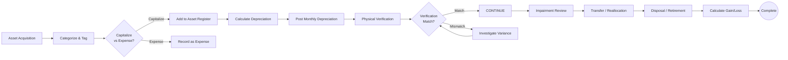

# Fixed Assets

## Workflow Purpose

Fixed asset management covers the lifecycle of capital assets from acquisition through depreciation, maintenance, transfer, and disposal.

## Business Objective

Maintain accurate records of capital assets, ensure proper depreciation treatment (GAAP/IFRS/tax), and comply with physical verification and reporting requirements.

## Primary Users

- **Accountant** — records acquisitions, depreciation, disposals
- **Controller** — reviews asset registers and impairment
- **Auditor** — verifies existence, valuation, and ownership

## Detailed Process

## Inputs & Outputs

| Inputs | Outputs |
|---|---|
| Purchase invoice / contract | Asset register |
| Asset category and useful life | Depreciation schedule |
| Physical verification results | Impairment assessment |
| Disposal documentation | Gain/loss on disposal |
| Tax depreciation rules | Tax depreciation report |

## Systems & Dependencies

| System | Role |
|---|---|
| ERP | Asset register, depreciation run |
| Procurement | Purchase data |
| Barcode/RFID | Physical tracking |
| Tax engine | Tax depreciation calculation |

## Approval Steps & Decision Points

| Step | Approver |
|---|---|
| Capitalization decision | Controller |
| Asset disposal | Controller |
| Impairment recognition | Controller → CFO |
| Useful life change | Controller |

## Risks & Bottlenecks

| Risk | Impact |
|---|---|
| Misclassified assets | Misstated financials |
| Incorrect depreciation | Accumulated error |
| Missing physical verification | Audit qualification |
| Unrecorded disposals | Inflated asset base |
| Impairment not recognized | Overstated assets |

## KPIs

| KPI | Target |
|---|---|
| Asset register accuracy | 100% |
| Physical verification completion | 100% annually |
| Depreciation accuracy | 100% |
| Disposal recording timeliness | < 30 days |
| Audit adjustments | Zero |

## Automation & AI Opportunities

| Opportunity | Impact |
|---|---|
| Automated depreciation calculation | Eliminates manual computation |
| Barcode/RFID integration | Real-time asset tracking |
| Impairment indicator monitoring | AI-driven flagging |
| Automated disposal processing | Reduces manual effort |
| Tax depreciation optimization | Strategic tax planning |

## Persona Mapping

| Persona | Involvement |
|---|---|
| Accountant | Primary performer |
| Controller | Reviewer and approver |
| Auditor | Consumer and tester |

## Competitive Analysis

| Capability | SAP | Oracle | Dynamics | NetSuite | Odoo | Perionyx |
|---|---|---|---|---|---|---|
| Asset register | ✅ | ✅ | ✅ | ✅ | ✅ | ❌ |
| Depreciation engine | ✅ | ✅ | ✅ | ✅ | ✅ | ❌ |
| Physical verification | ✅ | ✅ | ⚠️ | ✅ | ❌ | ❌ |
| Impairment testing | ✅ | ✅ | ❌ | ⚠️ | ❌ | ❌ |
| Tax depreciation | ✅ | ✅ | ⚠️ | ✅ | ❌ | ❌ |

## Perionyx Features Supporting Workflow

No direct support. Fixed assets are tracked via transactions only.

## Future Product Opportunities

| Opportunity | Priority |
|---|---|
| Fixed asset register | P2 |
| Depreciation engine with multiple methods (SL, DDB, SYD) | P2 |
| Physical verification tracking | P3 |
| Impairment assessment workflow | P3 |
