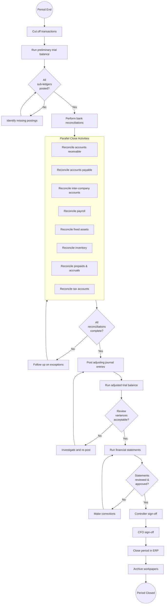
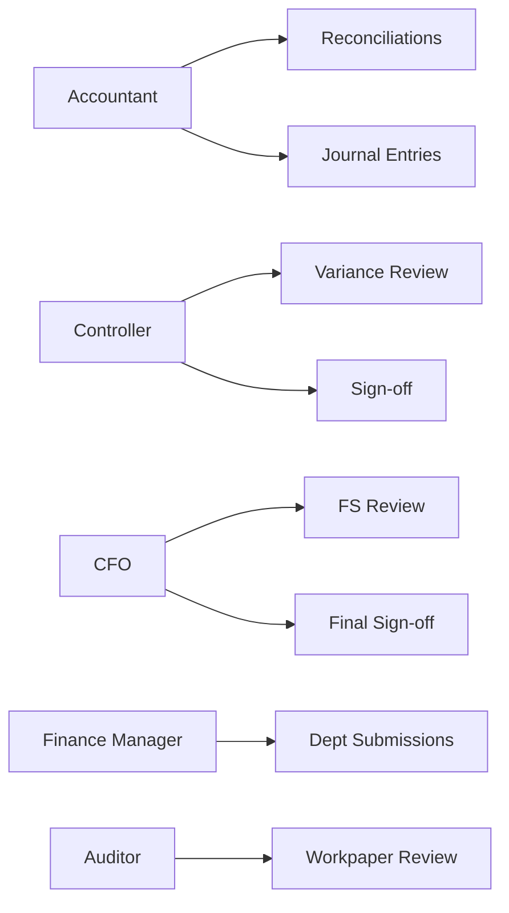

# Month-end Close

## Workflow Purpose

The month-end close is the periodic process of finalizing all financial transactions for a completed accounting period, ensuring the general ledger is accurate and complete before financial statements are produced.

## Business Objective

Produce accurate, timely, and auditable financial statements for the prior period while maintaining an unbroken audit trail.

## Primary Users

- **Controller** — owns the close calendar and sign-off process
- **Accountant** — performs reconciliation, journal posting, and variance analysis
- **CFO** — reviews final statements and signs off
- **Finance Manager** — coordinates departmental submissions

## Detailed Process

## Inputs & Outputs

| Inputs | Outputs |
|---|---|
| Sub-ledger transactions | Trial balance (pre and adjusted) |
| Bank statements | Bank reconciliations |
| Previous period balances | Journal entries (recurring, adjusting, reclassifying) |
| Payroll summary | Inter-company reconciliation |
| Fixed asset register | Financial statements (P&L, Balance Sheet, Cash Flow) |
| Inventory records | Close checklist with sign-offs |
| Inter-company balances | Audit-ready workpaper package |

## Systems & Dependencies

| System | Role |
|---|---|
| ERP (General Ledger) | Central record of all transactions |
| Sub-ledgers (AR, AP, FA, Payroll) | Transaction detail and aging |
| Bank portals | Statement downloads |
| Reconciliation tool | Match transactions, track exceptions |
| Reporting tool | Financial statement generation |
| Spreadsheets | Workpapers, manual adjustments, checklists |
| Email / collaboration | Approvals, exception communication |

## Approval Steps & Decision Points

| Step | Approver | Trigger | Fallback |
|---|---|---|---|
| Reconciliations sign-off | Accountant → Controller | All exceptions resolved | Escalate unreconciled items |
| Journal posting approval | Controller | Any manual journal > threshold | CFO review for material entries |
| Variance review sign-off | Controller → CFO | Variance > threshold % | Deep dive investigation |
| Financial statement sign-off | CFO | Controller approval | Board review for material issues |
| Period lock | Controller | All sign-offs complete | Emergency re-open process |

## Risks & Bottlenecks

| Risk | Impact | Likelihood | Mitigation |
|---|---|---|---|
| Late sub-ledger close | Delays entire close | Medium | Automated close calendar with reminders |
| Reconciliation exceptions | Manual investigation time | High | Exception auto-categorization |
| Inter-company mismatches | Parallel delay | Medium | Automated matching rules |
| Manual journal errors | Restatement risk | Medium | Journal approval workflow + audit trail |
| Spreadsheet version chaos | Data integrity risk | High | Template control, audit trail |
| Resource contention | Bottleneck at month-end | High | Pre-close preparation tasks |
| Last-minute adjustments | Re-work of statements | Medium | Early cut-off enforcement |

## KPIs & Common Delays

| KPI | Target | Common Delays |
|---|---|---|
| Close duration (days) | 3-5 days | Reconciliation exceptions (40%), inter-company (25%) |
| Journal entries volume | Tracked per period | Manual adjustments for accruals, prepaids |
| Reconciliation completion % | 100% | Missing statements, data mismatches |
| Variance investigation time | < 1 day | Incomplete data, unclear ownership |
| Audit ready timeline | 5 days post-close | Late workpaper compilation |
| CFO sign-off | Day 5 | Report generation delays, quality reviews |

## Automation & AI Opportunities

| Opportunity | Type | Impact | Effort |
|---|---|---|---|
| Automated bank statement import | Automation | Reduces manual data entry by 90% | Low |
| Reconciliation matching engine | Automation | Cuts exception volume by 60% | Medium |
| Journal entry auto-suggestion | AI | Reduces manual journal creation by 40% | High |
| Variance explanation generation | AI | Eliminates manual investigation notes | High |
| Close progress dashboard | Automation | Real-time visibility for management | Low |
| Pre-close checklist automation | Automation | Ensures no steps are missed | Low |
| Anomaly detection in trial balance | AI | Flags unusual entries before review | Medium |
| Natural language close summary | AI | Auto-generates close commentary | Medium |

## Persona Mapping

## Pain Point Mapping

| Pain Point | Category | Frequency | Severity |
|---|---|---|---|
| Manual reconciliation of high-volume accounts | REC | Monthly | Critical |
| Inter-company mismatches delaying close | MEC | Monthly | Major |
| Spreadsheet-based reporting | REP | Monthly | Major |
| No real-time close progress visibility | MEC | Monthly | Major |
| Manual journal entry validation | MEC | Monthly | Minor |
| Late departmental submissions | MEC | Monthly | Major |
| Version control on reports | REP | Monthly | Minor |
| Lack of audit trail on adjustments | AUD | Monthly | Critical |

## Competitive Analysis

| Capability | SAP | Oracle | Dynamics | NetSuite | Odoo | Perionyx |
|---|---|---|---|---|---|---|
| Automated reconciliation | ✅ | ✅ | ✅ | ✅ | ✅ | ✅ |
| Close calendar | ✅ | ✅ | ✅ | ✅ | ⚠️ | ⚠️ |
| Journal approval workflow | ✅ | ✅ | ✅ | ✅ | ✅ | ✅ |
| Variance analysis | ✅ | ✅ | ✅ | ✅ | ⚠️ | ⚠️ |
| Inter-company automation | ✅ | ✅ | ⚠️ | ✅ | ❌ | ❌ |
| Close progress dashboard | ✅ | ⚠️ | ❌ | ⚠️ | ❌ | ❌ |
| AI-powered close summary | ⚠️ | ⚠️ | ❌ | ❌ | ❌ | ❌ |
| Automated workpaper package | ✅ | ✅ | ❌ | ⚠️ | ❌ | ❌ |
| Real-time consolidation | ✅ | ✅ | ✅ | ✅ | ❌ | ❌ |
| Pre-close checklist | ✅ | ⚠️ | ⚠️ | ⚠️ | ⚠️ | ❌ |

**✅** = Full support, **⚠️** = Partial/Add-on, **❌** = Not available

## Perionyx Features Supporting Workflow

| Feature | Workflow Step | Status |
|---|---|---|
| Bank reconciliation | REC-001 to REC-005 | ✅ Shipped |
| Exception management | REC exceptions | ✅ Shipped |
| EnterpriseTable with filtering | Transaction review | ✅ Shipped |
| Approval workflows | Journal approval | ✅ Shipped |
| Audit logs | Audit trail | ✅ Shipped |
| Export center | Workpaper export | ✅ Shipped |

## Future Product Opportunities

| Opportunity | Priority | Differentiation |
|---|---|---|
| **Close calendar** — visual timeline with task ownership and sign-off tracking | P1 | Differentiator vs mid-market ERPs |
| **Close progress dashboard** — real-time % complete per entity/subsidiary | P1 | Strong differentiator |
| **Variance explanation AI** — auto-generate commentary on material changes | P1 | Market-leading AI feature |
| **Pre-close checklist** — automated task list with dependency tracking | P2 | Parity with SAP/Oracle |
| **Inter-company reconciliation** — automated matching and elimination | P2 | Enables multi-entity close |
| **Close summary report** — natural language period overview | P2 | AI differentiation |
| **Workpaper auto-packaging** — collate evidence per account | P3 | Auditor-friendly |
