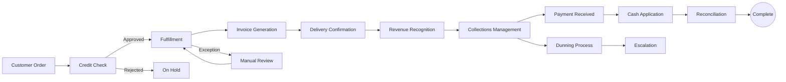

# Order to Cash (O2C)

## Workflow Purpose

Order to Cash (O2C) covers the entire lifecycle from receiving a customer order through delivery, invoicing, payment collection, and reconciliation.

## Business Objective

Accelerate cash conversion by reducing the time between order receipt and payment collection while minimizing credit risk and revenue leakage.

## Primary Users

- **AR Clerk** — manages invoicing, collections, cash application
- **Finance Manager** — oversees credit policy and collections strategy
- **Controller** — reviews AR aging and revenue recognition
- **CFO** — monitors DSO and cash flow impact

## Detailed Process

## Inputs & Outputs

| Inputs | Outputs |
|---|---|
| Customer order / contract | Invoice |
| Credit terms | Payment receipt |
| Delivery confirmation | Revenue recognized |
| Customer master data | AR aging report |
| Payment remittance | Dunning letters |
| Credit ratings | Cash application record |

## Systems & Dependencies

| System | Role |
|---|---|
| CRM / Sales | Order capture |
| ERP | Invoicing, AR ledger |
| Banking portal | Payment receipt |
| Collections tool | Dunning, aging |
| Reconciliation tool | Cash application |

## Approval Steps & Decision Points

| Step | Approver | Notes |
|---|---|---|
| Credit limit override | Finance Manager | Customer exceeds credit limit |
| Discount approval | Finance Manager | Early payment discount > standard |
| Write-off | Controller | Uncollectible receivable |
| Invoice adjustment | AR Clerk → Manager | Billing correction |

## Risks & Bottlenecks

| Risk | Impact |
|---|---|
| Late invoicing | Delays cash collection |
| Manual cash application | AR aging inaccuracy |
| Credit risk exposure | Bad debt |
| Revenue recognition errors | Restatement risk |
| Disputed invoices | Extended DSO |

## KPIs

| KPI | Target |
|---|---|
| Days Sales Outstanding (DSO) | < 30 days |
| Invoicing accuracy | > 99% |
| Cash application cycle time | < 24 hours |
| Credit-to-cash cycle | < 45 days |
| Dispute resolution time | < 5 days |
| Bad debt % of revenue | < 1% |

## Automation & AI Opportunities

| Opportunity | Impact |
|---|---|
| Automated invoice generation | Eliminates manual billing |
| AI-powered cash application | Auto-matches payments to invoices (90%+ match rate) |
| Smart dunning | AI-optimized collection sequence and timing |
| Credit risk scoring | Real-time credit decisions |
| Dispute prediction | Flags at-risk invoices before dispute |
| Payment reconciliation auto-match | Reduces manual effort by 80% |

## Persona Mapping

| Persona | Involvement | Tasks |
|---|---|---|
| AR Clerk | Primary | Invoicing, collections, cash application |
| Finance Manager | Owner | Credit policy, disputes, collections strategy |
| Controller | Reviewer | AR aging, revenue recognition |
| CFO | Consumer | DSO, cash flow monitoring |

## Pain Point Mapping

| Pain Point | Severity |
|---|---|
| Manual cash application | Major |
| No automated dunning | Major |
| Disconnected invoicing and payments | Major |
| No real-time AR aging visibility | Minor |
| Credit assessment takes too long | Minor |

## Competitive Analysis

| Capability | SAP | Oracle | Dynamics | NetSuite | Odoo | Perionyx |
|---|---|---|---|---|---|---|
| Invoice automation | ✅ | ✅ | ✅ | ✅ | ✅ | ❌ |
| Cash application AI | ✅ | ✅ | ✅ | ⚠️ | ❌ | ❌ |
| Automated dunning | ✅ | ✅ | ✅ | ✅ | ✅ | ❌ |
| Credit management | ✅ | ✅ | ⚠️ | ✅ | ⚠️ | ❌ |
| Dispute management | ✅ | ✅ | ⚠️ | ✅ | ❌ | ❌ |
| Revenue recognition | ✅ | ✅ | ✅ | ✅ | ⚠️ | ❌ |

## Perionyx Features Supporting Workflow

| Feature | Status |
|---|---|
| Transaction list with EnterpriseTable | ✅ Shipped |
| Export center (CSV, XLS) | ✅ Shipped |
| Audit log | ✅ Shipped |
| Approval workflows | ✅ Shipped |

## Future Product Opportunities

| Opportunity | Priority |
|---|---|
| Cash application AI (payment-to-invoice matching) | P1 |
| AR aging dashboard with drill-down | P2 |
| Automated dunning engine | P2 |
| Credit risk scoring | P2 |
| Dispute management workflow | P3 |
