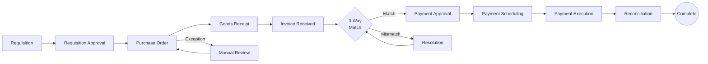

# Procure to Pay (P2P)

## Workflow Purpose

Procure to Pay (P2P) covers the end-to-end process from requisitioning goods or services through procurement, receipt, invoice processing, and payment execution.

## Business Objective

Optimize the procurement cycle by ensuring timely, accurate, and approved purchasing while maintaining control over spending and vendor relationships.

## Primary Users

- **AP Clerk** — processes invoices, matches to POs, schedules payments
- **Finance Manager** — approves exceptions, manages cash timing
- **Controller** — oversees AP aging and accruals
- **Auditor** — verifies procurement controls and approval chains

## Detailed Process

## Inputs & Outputs

| Inputs | Outputs |
|---|---|
| Purchase requisition | Purchase order |
| Vendor master data | Goods receipt record |
| Invoice (electronic or paper) | Invoice matching result |
| Contract terms | Payment instruction |
| Payment run schedule | AP aging report |
| Bank account details | Remittance advice |

## Systems & Dependencies

| System | Role |
|---|---|
| Procurement system | Requisition, PO management |
| ERP | AP ledger, invoice processing |
| Vendor portal | Invoice submission |
| Banking platform | Payment execution |
| Reconciliation tool | Payment matching |
| Document management | Invoice imaging and retrieval |

## Approval Steps & Decision Points

| Step | Approver | Notes |
|---|---|---|
| Requisition approval | Dept Manager | Budget check |
| PO approval | Finance Manager | > threshold ($10K+) |
| Invoice exception resolution | AP Clerk → Manager | Price/quantity mismatch |
| Payment approval | Finance Manager | > threshold |
| Early payment discount | Finance Manager | Financial decision |
| Vendor setup/change | Controller | Fraud prevention |

## Risks & Bottlenecks

| Risk | Impact |
|---|---|
| Invoice data entry errors | Delayed/payment errors |
| PO/Invoice mismatches | Manual resolution time |
| Duplicate payments | Financial loss |
| Late payment penalties | Vendor relationship damage |
| Fraud (phantom vendor) | Financial + compliance |
| Missed early payment discounts | Lost savings |

## KPIs

| KPI | Target |
|---|---|
| Invoice processing time | < 3 days |
| Invoice matching accuracy | > 95% |
| PO/invoice match rate | > 80% first pass |
| Payment accuracy | 99.9% |
| Early payment discount capture | > 90% of available |
| AP aging (current %) | > 80% |
| Duplicate payment rate | < 0.01% |

## Automation & AI Opportunities

| Opportunity | Impact |
|---|---|
| Automated 3-way matching | Cuts manual matching by 80% |
| AI invoice data extraction (OCR) | Eliminates manual entry |
| Intelligent payment scheduling | Optimizes cash timing |
| Duplicate payment detection | Prevents financial loss |
| Early payment discount optimizer | Maximizes savings |
| Automated vendor reconciliation | Reduces month-end workload |
| AI anomaly detection | Flags unusual patterns |

## Persona Mapping

| Persona | Involvement | Tasks |
|---|---|---|
| AP Clerk | Primary | Invoice processing, matching, payment runs |
| Finance Manager | Owner | Approval, exception handling, cash timing |
| Controller | Reviewer | AP aging, accruals, month-end |
| Auditor | Consumer | Control testing, AP audit |

## Pain Point Mapping

| Pain Point | Severity |
|---|---|
| Manual 3-way matching of invoices | Critical |
| Invoice data entry from paper/PDF | Major |
| Payment scheduling across entities | Major |
| No duplicate payment detection | Major |
| Disconnected PO-to-payment visibility | Major |
| Late payment penalty tracking | Minor |

## Competitive Analysis

| Capability | SAP | Oracle | Dynamics | NetSuite | Odoo | Perionyx |
|---|---|---|---|---|---|---|
| 3-way matching | ✅ | ✅ | ✅ | ✅ | ✅ | ❌ |
| Invoice OCR | ✅ | ✅ | ✅ | ⚠️ | ⚠️ | ❌ |
| Payment scheduling | ✅ | ✅ | ✅ | ✅ | ✅ | ❌ |
| Duplicate payment detection | ✅ | ⚠️ | ⚠️ | ❌ | ❌ | ❌ |
| Vendor portal | ✅ | ✅ | ⚠️ | ✅ | ❌ | ❌ |
| Procurement analytics | ✅ | ✅ | ✅ | ⚠️ | ❌ | ❌ |

## Perionyx Features Supporting Workflow

| Feature | Status |
|---|---|
| Transaction list | ✅ Shipped |
| Approval workflows | ✅ Shipped |
| Export center | ✅ Shipped |
| Audit log | ✅ Shipped |

## Future Product Opportunities

| Opportunity | Priority |
|---|---|
| Invoice matching engine (3-way match) | P1 |
| AP aging dashboard with drill-down | P2 |
| Payment scheduling and execution | P1 |
| Duplicate payment detection | P2 |
| Vendor management module | P2 |
| Invoice OCR and data extraction | P2 |
