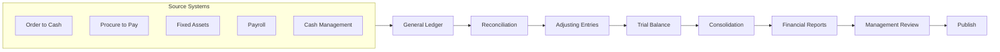

# Record to Report (R2R)

## Workflow Purpose

Record to Report (R2R) is the end-to-end process of capturing financial transactions from source systems, processing them through the general ledger, and producing consolidated financial reports for internal and external stakeholders.

## Business Objective

Maintain a complete, accurate, and auditable record of all financial transactions from origination to reporting, ensuring compliance with accounting standards (GAAP/IFRS).

## Primary Users

- **Accountant** — performs data entry, reconciliation, and journal processing
- **Controller** — oversees process integrity and approves adjustments
- **CFO** — reviews consolidated reports and signs off
- **Auditor** — verifies accuracy and completeness of the record

## Detailed Process

## Inputs & Outputs

| Inputs | Outputs |
|---|---|
| Sub-ledger transactions (AR, AP, FA, Payroll) | Trial balance |
| Bank statements | Adjusted trial balance |
| Inter-company transactions | Consolidated financial statements |
| Previous period adjustments | Management reports |
| Currency rates | Variance analysis |
| Organizational hierarchy | Audit workpapers |
| Chart of accounts | Disclosure notes |

## Systems & Dependencies

| System | Role |
|---|---|
| ERP | General ledger, sub-ledgers |
| Reconciliation tool | Account matching, exception tracking |
| Consolidation tool | Multi-entity, multi-currency |
| Reporting tool | Statement generation |
| Tax engine | Tax calculation and reporting |

## Approval Steps & Decision Points

| Step | Approver | Notes |
|---|---|---|
| Journal entry posting | Controller | Manual entries require approval |
| Entity close sign-off | Local Controller | All reconciliations complete |
| Consolidation review | Group Controller | Inter-company eliminations verified |
| Financial statement review | CFO | Material variance explanations |
| Publication approval | CFO / Board | Final sign-off |

## Risks & Bottlenecks

| Risk | Impact |
|---|---|
| Sub-ledger not in sync with GL | Reconciliation delays |
| Inter-company mismatches | Consolidation delays |
| Currency translation errors | Misstated financials |
| Manual reclassification entries | Data integrity risk |
| Chart of accounts inconsistency | Consolidation complexity |

## KPIs

| KPI | Target |
|---|---|
| End-to-end cycle time | < 5 business days |
| Journal entry accuracy | > 99% |
| Inter-company match rate | > 95% |
| Audit adjustments (% of entries) | < 1% |
| Time to consolidate 10 entities | < 2 days |

## Automation & AI Opportunities

| Opportunity | Impact |
|---|---|
| Automated sub-ledger posting | Eliminates manual transfer entries |
| AI-powered account reconciliation recommendations | Reduces investigation time by 50% |
| Automated inter-company matching and elimination | Eliminates manual reconciliation |
| Natural language financial review | Generates executive summaries |
| Anomaly detection in journal entries | Flags unusual patterns |
| Automated consolidation processing | Reduces close time by 30% |

## Persona Mapping

| Persona | Involvement | Tasks |
|---|---|---|
| Accountant | Primary | Reconciliation, journal entry, sub-ledger management |
| Controller | Owner | Process oversight, sign-off, variance review |
| CFO | Approver | Statement review, final approval |
| Auditor | Consumer | Evidence collection, testing |

## Pain Point Mapping

| Pain Point | Severity |
|---|---|
| Manual inter-company reconciliation | Major |
| Spreadsheet-based consolidation | Major |
| Late sub-ledger close | Major |
| Audit evidence collection | Minor |
| Currency translation errors | Critical |

## Competitive Analysis

| Capability | SAP | Oracle | Dynamics | NetSuite | Odoo | Perionyx |
|---|---|---|---|---|---|---|
| Multi-entity consolidation | ✅ | ✅ | ✅ | ✅ | ⚠️ | ❌ |
| Inter-company automation | ✅ | ✅ | ⚠️ | ✅ | ❌ | ❌ |
| Journal approval workflow | ✅ | ✅ | ✅ | ✅ | ✅ | ✅ |
| Audit trail | ✅ | ✅ | ✅ | ✅ | ✅ | ✅ |
| Automated sub-ledger posting | ✅ | ✅ | ✅ | ✅ | ✅ | ❌ |
| Consolidation dashboards | ✅ | ⚠️ | ⚠️ | ✅ | ❌ | ❌ |

## Perionyx Features Supporting Workflow

| Feature | Status |
|---|---|
| Ledger view | ✅ Shipped |
| Journal entry tracking | ✅ Shipped |
| Audit log | ✅ Shipped |
| Reconciliation | ✅ Shipped |
| EnterpriseTable with filtering | ✅ Shipped |

## Future Product Opportunities

| Opportunity | Priority |
|---|---|
| Multi-entity consolidation | P1 |
| Inter-company reconciliation and matching | P1 |
| Automated sub-ledger posting | P2 |
| Consolidation dashboard with drill-down | P2 |
| AI journal entry anomaly detection | P1 |
