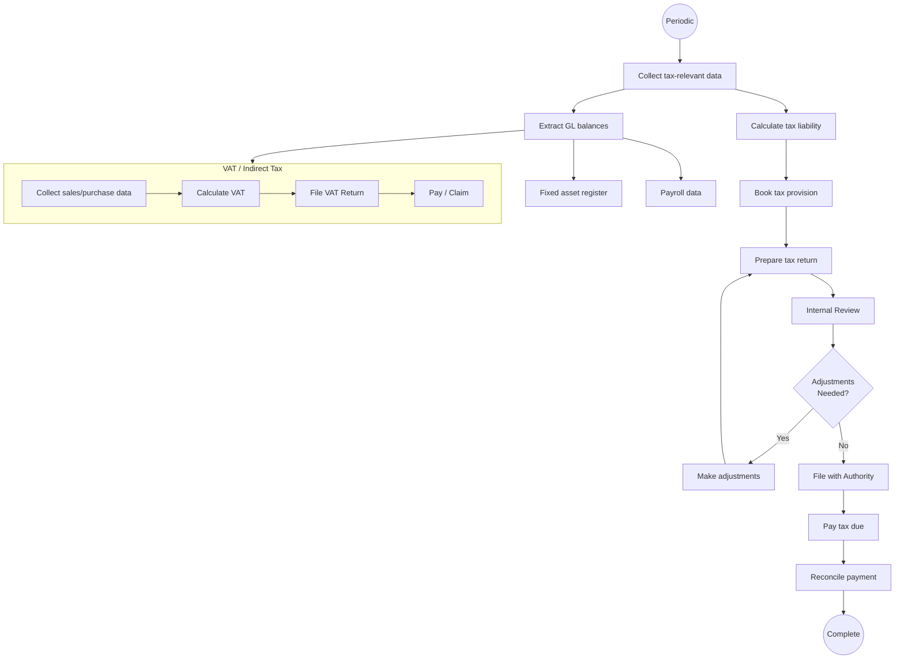

# Tax Management

## Workflow Purpose

Tax management covers the calculation, filing, and payment of all taxes (corporate income tax, VAT/GST, withholding tax, property tax, transfer pricing) across jurisdictions.

## Business Objective

Ensure timely and accurate tax compliance across all jurisdictions, minimize tax liability through proper planning, and maintain defensible tax positions.

## Primary Users

- **Tax Accountant** — performs tax calculations, prepares returns
- **Tax Manager** — oversees compliance and planning
- **Controller** — reviews tax provisions and accruals
- **CFO** — approves tax strategy and significant exposures

## Detailed Process

## Inputs & Outputs

| Inputs | Outputs |
|---|---|
| Trial balance | Tax provision calculation |
| Fixed asset register (tax vs book) | Corporate tax return |
| Payroll records | W-2 / equivalent |
| Sales and purchase data (VAT) | VAT return |
| Prior year returns | Transfer pricing documentation |
| Tax law changes | Tax payment instruction |
| Inter-company transactions | Tax reconciliation (book to tax) |

## Systems & Dependencies

| System | Role |
|---|---|
| ERP | GL, fixed assets, AP/AR data |
| Tax software | Return preparation and filing |
| Fixed asset system | Tax depreciation |
| Payroll system | Withholding data |
| Regulatory filing system | E-filing |

## Approval Steps & Decision Points

| Step | Approver |
|---|---|
| Tax provision review | Controller |
| Tax return review | Tax Manager → Controller |
| Significant position | CFO |
| Transfer pricing policy | CFO |
| Filing extension | Tax Manager |

## Risks & Bottlenecks

| Risk | Impact |
|---|---|
| Missed filing deadline | Penalties and interest |
| Incorrect tax calculation | Under/overpayment |
| Transfer pricing non-compliance | Double taxation |
| Tax law change not captured | Incorrect position |
| Incomplete data across entities | Extended filing time |

## KPIs

| KPI | Target |
|---|---|
| Filing on-time % | 100% |
| Effective tax rate variance | < 1% of expected |
| Audit adjustment rate | < 1% of provisions |
| Tax controversy cycle time | < 12 months resolution |
| VAT recovery rate | > 95% of eligible |

## Automation & AI Opportunities

| Opportunity | Impact |
|---|---|
| Automated tax provision calculation | Eliminates manual computation |
| AI-powered tax law change detection | Proactive compliance |
| Automated VAT return preparation | Reduces effort by 80% |
| Transfer pricing documentation automation | Reduces manual compilation |
| Tax reconciliation (book to tax) | Eliminates manual spreadsheet |
| Multi-jurisdiction filing calendar | Ensures no missed deadlines |
| AI audit risk scoring | Flags high-risk positions |

## Persona Mapping

| Persona | Involvement |
|---|---|
| Tax Accountant | Primary performer |
| Tax Manager | Owner, reviewer |
| Controller | Provision reviewer |
| CFO | Strategy approver |

## Pain Point Mapping

| Pain Point | Severity |
|---|---|
| Manual tax provision calculation | Critical |
| Spreadsheet-based VAT return prep | Major |
| No multi-jurisdiction filing calendar | Major |
| Transfer pricing documentation is manual | Major |
| Tax law change tracking is manual | Minor |

## Competitive Analysis

| Capability | SAP | Oracle | Dynamics | NetSuite | Odoo | Perionyx |
|---|---|---|---|---|---|---|
| Tax provision | ✅ | ✅ | ✅ | ✅ | ❌ | ❌ |
| VAT/GST return | ✅ | ✅ | ✅ | ✅ | ✅ | ❌ |
| Tax depreciation | ✅ | ✅ | ✅ | ✅ | ✅ | ❌ |
| Transfer pricing | ✅ | ✅ | ❌ | ❌ | ❌ | ❌ |
| Multi-jurisdiction | ✅ | ✅ | ✅ | ✅ | ⚠️ | ❌ |
| Tax compliance calendar | ✅ | ✅ | ⚠️ | ✅ | ❌ | ❌ |

## Perionyx Features Supporting Workflow

No direct tax management support.

## Future Product Opportunities

| Opportunity | Priority |
|---|---|
| VAT return calculation and filing | P2 |
| Tax provision and reconciliation | P2 |
| Multi-jurisdiction compliance calendar | P3 |
| Transfer pricing documentation | P3 |
