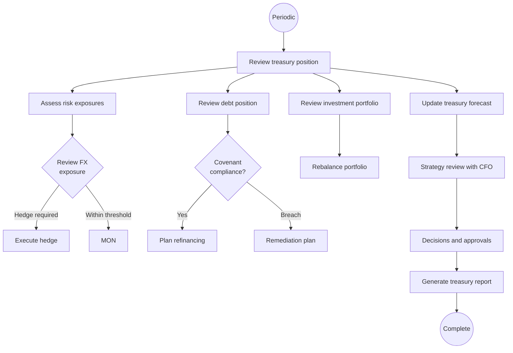

# Treasury Operations

## Workflow Purpose

Treasury Operations covers the strategic and operational management of an organization's financial assets, liabilities, and risk exposures including debt, investments, FX, and inter-company funding.

## Business Objective

Optimize the organization's financial structure by managing liquidity, funding, currency risk, and investment portfolios while maintaining compliance with treasury policies and covenants.

## Primary Users

- **Treasury Director** — owns all treasury operations
- **CFO** — approves strategy, major transactions, and policy
- **Finance Manager** — executes transactions and manages bank relationships

## Detailed Process

## Inputs & Outputs

| Inputs | Outputs |
|---|---|
| Cash position | Treasury report |
| Debt schedule / covenants | Hedge portfolio |
| Investment portfolio | Investment performance report |
| FX exposures | FX risk report |
| Bank facility agreements | Covenant compliance report |
| Interest rate forecasts | Funding plan |
| Credit ratings | Bank relationship scorecard |

## Systems & Dependencies

| System | Role |
|---|---|
| TMS | Core treasury operations |
| Bloomberg / Reuters | Market data, rates |
| Bank portals | Facility management |
| Swap / derivative platforms | Hedge execution |
| ERP | Counterparty exposure data |
| Rating agencies | Credit rating data |

## Approval Steps & Decision Points

| Step | Approver |
|---|---|
| Hedge execution | Treasury Director → CFO |
| Investment > threshold | Treasury Director → CFO |
| Debt facility change | CFO → Board |
| Bank account opening | Treasury Director → CFO |
| Inter-company loan pricing | CFO |
| Treasury policy change | CFO → Board |

## Risks & Bottlenecks

| Risk | Impact |
|---|---|
| Unhedged FX exposure | Earnings volatility |
| Covenant breach | Accelerated repayment |
| Counterparty default | Financial loss |
| Failed hedge settlement | Basis risk |
| Interest rate exposure | Margin compression |
| Liquidity crisis | Inability to pay |

## KPIs

| KPI | Target |
|---|---|
| FX exposure hedged % | Per policy (80%+) |
| Investment return vs benchmark | At or above |
| Covenant headroom | > 20% |
| Debt refinancing lead time | > 6 months |
| Hedge effectiveness | > 80% |
| Bank relationship satisfaction | > 4/5 |
| Treasury operations cost % of assets | < 0.1% |

## Automation & AI Opportunities

| Opportunity | Impact |
|---|---|
| Automated FX exposure monitoring | Real-time risk visibility |
| AI hedge recommendation engine | Optimal hedging strategy |
| Covenant compliance tracking | Automated alerts |
| Investment portfolio optimization | ML-driven rebalancing |
| Treasury forecasting | Cash flow + risk prediction |
| Bank relationship analytics | Fee and service optimization |
| Automated treasury reporting | Eliminates manual compilation |

## Persona Mapping

| Persona | Involvement |
|---|---|
| Treasury Director | Primary owner |
| CFO | Approver and strategist |
| Finance Manager | Operator |
| Executive Viewer | Report consumer |

## Pain Point Mapping

| Pain Point | Severity |
|---|---|
| Manual FX exposure tracking | Critical |
| Spreadsheet-based treasury reporting | Major |
| No covenant compliance monitoring | Major |
| Disconnected investment tracking | Major |
| No real-time treasury position | Critical |

## Competitive Analysis

| Capability | SAP | Oracle | Dynamics | NetSuite | Odoo | Perionyx |
|---|---|---|---|---|---|---|
| FX management | ✅ | ✅ | ❌ | ⚠️ | ❌ | ⚠️ |
| Debt management | ✅ | ✅ | ❌ | ❌ | ❌ | ❌ |
| Investment management | ✅ | ✅ | ❌ | ❌ | ❌ | ❌ |
| Hedge accounting | ✅ | ✅ | ❌ | ❌ | ❌ | ❌ |
| Bank relationship mgmt | ✅ | ✅ | ❌ | ❌ | ❌ | ❌ |
| Covenant tracking | ✅ | ⚠️ | ❌ | ❌ | ❌ | ❌ |

## Perionyx Features Supporting Workflow

| Feature | Status |
|---|---|
| Wallet management | ✅ Shipped |
| FX rate display (admin) | ⚠️ Admin only |
| Transaction tracking | ✅ Shipped |

## Future Product Opportunities

| Opportunity | Priority |
|---|---|
| FX exposure dashboard | P1 |
| Hedge recommendation engine | P1 |
| Debt and covenant tracking | P1 |
| Treasury reporting suite | P1 |
| Investment portfolio management | P2 |
| Bank relationship management | P2 |
